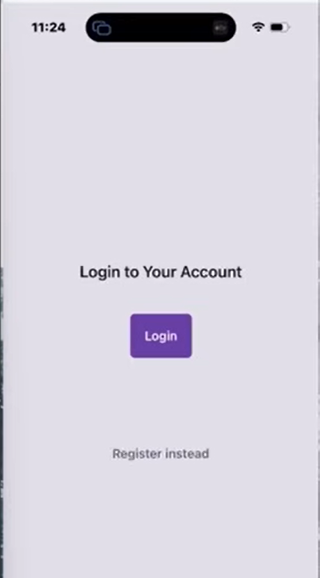
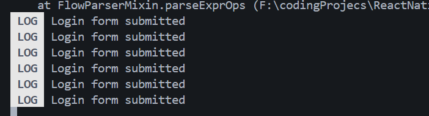

## 8- Pressable Component & Custom Buttons

So We have the login page and the register page inside the auth folder

ignore these red lines

we will add one thing to each page that is a button which will serve as a submit button to the login and register forms when we create them.

`But I'd introduce the idea of making pressable buttons now which we can add to these pages.`

in the case of a mobile app the user pressing on the screen where the button is and to react to those presses on the screen React Native provides us with a component called pressible.

### 1. The Pressable Component

In React Native, we use the `Pressable` component to detect and respond to various stages of press interactions (clicks on mobile).

- **Import:** `import { Pressable } from "react-native";`
- **Visual Presence:** By default, `Pressable` has no visual styles (no background, no border). You must style it manually using the `style` prop.
- **State-Based Styling:** Unlike a standard `View`, `Pressable` can accept a **function** in its style prop. This function receives an object containing a `pressed` boolean.

```javascript
<Pressable
  style={({ pressed }) => [
    styles.btn,
    pressed && styles.pressed, // Conditional style applied only when pressed
  ]}
>
  <Text>Click Me</Text>
</Pressable>
```

### 2. Handling Events

To trigger logic when a user finishes a press, use the `onPress` prop.

- **Logic:** Define a handler function (e.g., `handleSubmit`) inside your component.
- **Trigger:** Pass that function to the `onPress` prop of the `Pressable`.

---

### 3. Reusable "ThemedButton" Component

To keep code DRY (Don't Repeat Yourself), it is best practice to extract the button logic into a separate, reusable component.

**File:** `./components/ThemedButton.jsx`

```javascript
import { Pressable, StyleSheet } from "react-native";
import { Colors } from "../constants/Colors";

const ThemedButton = ({ children, style, ...props }) => {
  return (
    <Pressable
      style={({ pressed }) => [
        styles.button,
        pressed && styles.pressed,
        style, // Allows overriding styles from outside
      ]}
      {...props} // Spreads onPres and other props to the Pressable
    >
      {children}
    </Pressable>
  );
};

export default ThemedButton;

const styles = StyleSheet.create({
  button: {
    backgroundColor: Colors.primary,
    padding: 15,
    borderRadius: 8,
    alignItems: "center",
  },
  pressed: {
    opacity: 0.7, // Visual feedback: button fades slightly when touched
  },
});
```

---

### 4. Implementation in Pages

Using the custom button simplifies the code in your route screens (Login/Register).

**File:** `./app/(auth)/login.jsx`

```javascript
import ThemedButton from "../../components/ThemedButton";
import { Text } from "react-native";

const Login = () => {
  const handleLogin = () => {
    console.log("Login form submitted");
  };

  return (
    <ThemedView style={styles.container}>
      {/* ... other components ... */}

      <ThemedButton onPress={handleLogin}>
        <Text style={{ color: "#F2F2F2" }}>Login</Text>
      </ThemedButton>
    </ThemedView>
  );
};
```




### Key Takeaways

- **Function as Style:** `Pressable` styles use `({ pressed }) => []` to toggle appearances.
- **Opacity for Feedback:** A common mobile pattern is reducing opacity during the `pressed` state so the user knows the touch was registered.
- **Prop Forwarding:** By using `{...props}` in your custom component, you ensure that standard props like `onPress` or `onLongPress` are automatically passed down to the underlying `Pressable` component.
