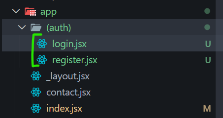
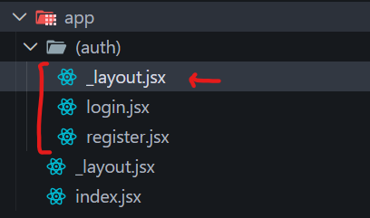

# 7- Route Groups & Nested Layouts

as long as we're using the themed components, we don't need to worry about conditionally styling things within the pages anymore based on the users color scheme setting because all that heavy lifting gets done within those themed components → [6- **Themed UI Components, ChildernProp-Shortcut, Spacer Components, utility components, (important)**]

---

### 2. Route Groups (Core Concept)

#### ❌ Normal folder behavior:

```
/auth/login.jsx → /auth/login
```

#### ✅ Route Group:

Wrap folder in parentheses:

```
/(auth)/login.jsx → /login
```

👉 Folder is used for **organization ONLY**, not URL.

---

## 🧱 3. Creating Pages



Inside `(auth)`:

- `login.jsx` and `register.jsx`

Routes:

```
/login
/register
```

---

Instead of styling per screen: Use **ThemedView and** Use **ThemedText →** All styling logic (dark/light mode) is centralized

**Result:** No more conditional styling everywhere

```jsx
import { StyleSheet } from "react-native";

import { Link } from "expo-router";
import ThemedView from "../../components/ThemedView";
import Spacer from "../../components/Spacer";
import ThemedText from "../../components/ThemedText";

const Login = () => {
  return (
    <ThemedView style={styles.container}>
      <Spacer />
      <ThemedText title={true} style={styles.title}>
        Login to your Account
      </ThemedText>

      <Spacer height={100} />
      <Link href="/register">
        <ThemedText style={{ textAlign: "center" }}>
          Register instead
        </ThemedText>
      </Link>
    </ThemedView>
  );
};

export default Login;

const styles = StyleSheet.create({
  container: {
    flex: 1,
    justifyContent: "center",
  },
  title: {
    textAlign: "center",
    fontSize: 18,
    marginBottom: 30,
  },
});
```


and similarly we create register.jsx

---

#### ⚠️ 8. Problem: Ugly Headers

You see:

```
(auth)/login
```

That’s garbage UX.


#### **9. Nested Layouts (Important)**

Create inside `(auth)`:

```jsx
./app/(auth)/_layout.jsx
```

**_What it does :_** Applies config to ALL pages in that group



---

Register it manually in root layout:

we create `_layout.jsx` the path is `./app/(auth)/_layout.jsx`

```jsx
import { Stack } from "expo-router";
import { StatusBar } from "expo-status-bar";

export default function AuthLayout() {
  return (
    <>
      <StatusBar style="auto" />
      <Stack screenOptions={{ headerShown: false, animation: "none" }}></Stack>
    </>
  );
}
```

`single <Stack ..></Stack>`and then we have this one stack right here. This one stack component. We don't have individual screens for the `login` and `register` because we don't really need to set options on them individually. We just want some options screen options applied to the whole thing. Right? So when we do it on the stack itself, not the individual screens, these options apply to every individual page for that layout. So these two automatically. Okay.

`animation : "none"` → So we're saying header shown and also animation none. And that just means when we flip between the pages, they're not going to slide. it will be flick.

---

Even after hiding headers:

- `(auth)` may still appear.


**_Fix_**: → Register it manually in root layout:

```jsx
./app/_layout.jsx

<Stack.Screen
  name="(auth)"
  options={{ headerShown: false }}
/>
```

#### Now


it's completely gone now. So now we've removed the header right here.

#### So.. ( important)

So now we've removed the header right here

```jsx
./app/_layout.jsx

const _layout = () => {
 ...
  return (
    <>
        <Stack.Screen name="(auth)" options={{ headerShown: false }} />
    </>
  );
};
```

and also right here.

```jsx
./app/(auth)/_layout.jsx

const _layout = () => {
 ...
  return (
    <>
        <Stack screenOptions={{ headerShown: false, animation: "none" }}></Stack>
    </>
  );
};
```

So in both places.

Now I want to show you what happens if we uh remove this. If I take that out and save it, then it's going to come back and it just says login, right? So we just get the actual page name. And if I go to the register page, it's just going to say register.

```jsx
./app/(auth)/_layout.jsx

const _layout = () => {
 ...
  return (
    <>                         // Removing this ↓
        <Stack screenOptions={{ *~~headerShown: false,~~* animation: "none" }}></Stack>
    </>
  );
};
```

Result :


