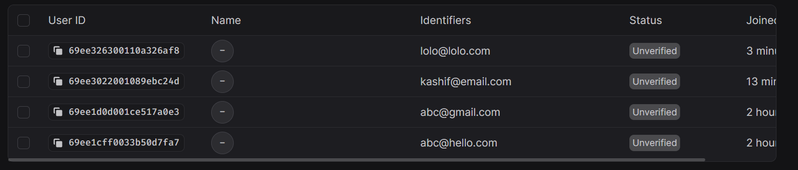
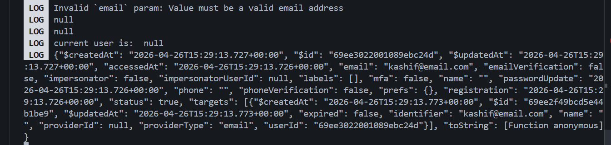

# 14. Registration and Login with Appwrite

With the global context and the **Appwrite SDK** ready, we can now implement the actual logic to create accounts and manage user sessions.

---

## 1. The Registration Flow

In Appwrite, "creating an account" and "logging in" are two separate steps. When a user registers, you create the account first, then manually trigger a login to create a session.

**File:** `./context/userContext.jsx`

- **`ID.unique()`**: A utility from the Appwrite SDK that generates a unique string for the user's ID.
- **`account.create()`**: Sends the registration request to the backend.

```javascript
import { ID } from "react-native-appwrite";
import { account } from "../lib/appwrite";

const register = async (email, password) => {
  try {
    // 1. Create the user account
    await account.create(ID.unique(), email, password);

    // 2. Log them in immediately after registration
    await login(email, password);
  } catch (error) {
    console.log("Registration Error:", error.message);
    throw error;
  }
};
```

---

## 2. The Login Flow

To log a user in, we create a **"Session."** Once the session is created, we use `account.get()` to retrieve the full user object (containing their ID, email, etc.) and store it in our global state.

**File:** `./context/userContext.jsx`

- **`createEmailPasswordSession`**: The specific method to authenticate via email/password.
- **`account.get()`**: Fetches the currently authenticated user's details.

```javascript
const login = async (email, password) => {
  try {
    // 1. Create the session (logs the user in on the server)
    await account.createEmailPasswordSession(email, password);

    // 2. Get user details and update global state
    const response = await account.get();
    setUser(response);
  } catch (error) {
    console.log("Login Error:", error.message);
    throw error;
  }
};
```

---

## 3. Triggering from the UI

In your `login.jsx` or `register.jsx` pages, you use the `useUser` hook to call these functions. It is best practice to wrap these calls in a `try...catch` block to handle potential issues (like a password being too short or an email already existing).

**Example in `register.jsx`:**

```javascript
const { register } = useUser();

const handleSubmit = async () => {
  try {
    await register(email, password);
    // Success! The global 'user' state is now updated.
  } catch (err) {
    // Handle error (e.g., show an alert to the user)
    alert(err.message);
  }
};
```

---

## 4. Verifying the User State

Once the user is logged in, the user object in your context will change from `null` to a data-rich object. You can verify this by logging the user in any layout or page:

```javascript
const { user } = useUser();
console.log("Logged in user:", user?.email); // Should show the user's email address
```

---

## 💡 Key Takeaways

- **Session Persistence:** Appwrite handles the heavy lifting of keeping the user logged in even if the app is closed and reopened.
- **Explicit Login:** Always remember that `account.create` only makes the record; you must call `createEmailPasswordSession` to actually start a user session.
- **Error Handling:** Appwrite returns helpful error messages (e.g., "Invalid credentials"). Passing these back to the UI helps users understand what went wrong.

### Method Summary

| Method                               | Purpose                                        | Source                  |
| :----------------------------------- | :--------------------------------------------- | :---------------------- |
| `ID.unique()`                        | Generates a random unique ID for new users.    | `react-native-appwrite` |
| `account.create`                     | Adds a new user record to the backend.         | `lib/appwrite.js`       |
| `account.createEmailPasswordSession` | Authenticates a user and starts a session.     | `lib/appwrite.js`       |
| `account.get()`                      | Returns data for the currently logged-in user. | `lib/appwrite.js`       |

---




