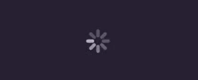

These notes cover the implementation of a **Themed Loading Screen** using the native `ActivityIndicator` component. This replaces the unstyled "loading..." text with a professional, centered spinner that automatically adapts to Light and Dark modes.

---

## **1. The `ActivityIndicator` Component**

This is a built-in React Native component that displays a circular loading spinner.

- **`size`**: Can be set to `"small"` or `"large"`.
- **`color`**: Sets the color of the spinner.
- **Platform Behavior**: It renders as a standard iOS spinner or Android "throbber" automatically.

---

## **2. Creating the Reusable `ThemedLoader`**

To avoid unstyled white screens, we wrap the spinner in a `<ThemedView>` and center it. This ensures the background color matches the rest of the app immediately.

**File Path:** `./components/ThemedLoader.jsx`

```jsx
import { ActivityIndicator, StyleSheet, useColorScheme } from "react-native";
import { Colors } from "../constants/Colors";
import ThemedView from "./ThemedView";

const ThemedLoader = () => {
  const colorScheme = useColorScheme();
  const theme = Colors[colorScheme] ?? Colors.light;

  return (
    <ThemedView style={styles.container}>
      <ActivityIndicator size="large" color={theme.text} />
    </ThemedView>
  );
};

export default ThemedLoader;

const styles = StyleSheet.create({
  container: {
    flex: 1,
    justifyContent: "center",
    alignItems: "center",
  },
});
```

---

## **3. Implementing the Loader in Route Guards**

Now we replace the ugly `Text` component in our authentication wrappers. This provides a "Full Screen" loading experience while the app checks the user's session.

**File Path:** `./components/auth/UserOnly.jsx` (and `GuestOnly.jsx`)

```jsx
import ThemedLoader from "../ThemedLoader";
// ... imports

const UserOnly = ({ children }) => {
  const { user, authChecked } = useUser();
  const router = useRouter();

  // ... useEffect logic ...

  if (!authChecked || !user) {
    // Replaced <Text>Loading...</Text> with our themed component
    return <ThemedLoader />;
  }

  return children;
};
```

---

## **4. Why Use a Themed Wrapper?**

Without this approach, the user sees a "Flicker of White" (FOW) when navigating between protected pages.

1. **Background Sync**: By using `theme.background` (via `ThemedView`), the screen is instantly the correct color (e.g., Deep Navy for dark mode).
2. **Visual Feedback**: The `ActivityIndicator` tells the user the app is working, not frozen.
3. **Flexbox Centering**: `justifyContent: "center"` and `alignItems: "center"` ensure the spinner is perfectly dead-center on all device sizes.

---

## **5. Summary Checklist**

| Goal            | Action                                                                             |
| --------------- | ---------------------------------------------------------------------------------- |
| **Visibility**  | Set `color` to `theme.text` so it contrasts with the background.                   |
| **Full Screen** | Set `flex: 1` on the wrapper so it covers the entire device real estate.           |
| **Consistency** | Use `ThemedView` as the base so the background matches your `Colors.js` constants. |
| **Application** | Swap out all raw `Text` loading indicators for the new `<ThemedLoader />`.         |

### **Key Takeaway**

A "Loading State" is a screen the user will see frequently (during startup, login, or slow network requests). Using an `ActivityIndicator` inside a themed container makes the app feel "Native" and high-quality, rather than a web-app wrapper.

---

<br>
<br>
<br>

**This is how `ActivityIndicator` Component would look like**



```jsx
import { ActivityIndicator } from "react-native";

<ActivityIndicator size="large" color="white" />;
```

### Now

`Login Page → ( Loading Screen ) → Profile Page`
