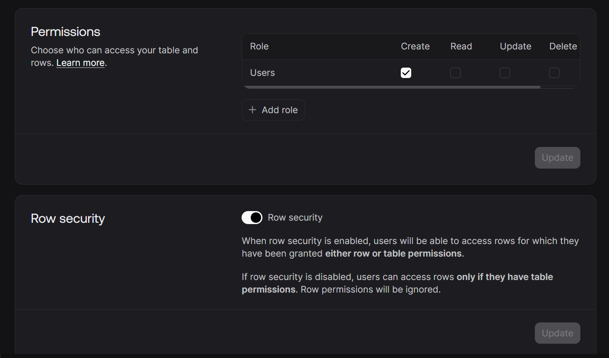

We simpliy gone to AppWrite, created a DB, created few Columns, and then gave permission to User, add Row Security,
in the **:** `./lib/appwrite.js` we import Databases and export the usage of that .

that’s it.

---

These notes cover setting up the **Appwrite Database** service. This includes creating the database, defining the schema (attributes), and configuring permissions to ensure users can only see their own data.

---

## **1. Appwrite Database Concepts**

Appwrite uses a NoSQL-like structure, but with a strict schema to ensure data integrity.

- **Database**: The top-level container for your application data.
- **Collection**: Similar to a **Table** in SQL. It groups similar records (e.g., a "books" collection).
- **Document**: A single record or row within a collection.
- **Attributes**: The specific fields or columns (e.g., `title`, `author`).

---

## **2. Creating the Collection & Attributes**

Every collection needs a **Schema** (Structure). Appwrite enforces this; if you try to save a document that doesn't match these attributes, the request will fail.

**Setup Steps in Appwrite Console:**

1. **Create Database**: e.g., `Shelfie Native App DB`.
2. **Create Collection**: e.g., `books`.
3. **Define Attributes**: Navigate to the **Attributes** tab and add the following:

| **Attribute Key** | **Type** | **Size** | **Required** | **Description**                            |
| ----------------- | -------- | -------- | ------------ | ------------------------------------------ |
| `title`           | String   | 255      | Yes          | The title of the book.                     |
| `author`          | String   | 255      | Yes          | The person who wrote the book.             |
| `description`     | String   | 500      | Yes          | A brief summary of the book.               |
| `userId`          | String   | 255      | Yes          | The ID of the user who created the record. |


---

## **3. Permissions & Document Security**

By default, databases are locked. You must explicitly grant permissions to allow your React Native app to interact with them.

**File Permissions Settings:**

- **Add Role**: Select **"Users"** (any authenticated user).
- **Permissions**: Check **"Create"**. This allows any logged-in user to add a new book.
- **Document Security**: **Enable** this.
  - _Why?_ Enabling Document Security allows us to specify that **User A** can only read/edit their own books, while **User B** can only read/edit theirs. Without this, any logged-in user could see everyone's books.



---

## **4. Initializing the Database in the App**

To use the database in your code, you must add the `Databases` service to your Appwrite configuration file.

**File Path:** `./lib/appwrite.js`

```jsx
import { Client, Account, Avatars, Databases } from "react-native-appwrite";

export const client = new Client();

client.setProject("67c5d24d000f9172f860").setPlatform("dev.netninja.sheflie");

export const account = new Account(client);
export const avatars = new Avatars(client);
export const databases = new Databases(client);
```

---

## **5. Logic Flow Recap**

| **Sequence**      | **Location**        | **Action**                                                                   |
| ----------------- | ------------------- | ---------------------------------------------------------------------------- |
| **1. Definition** | Appwrite Console    | Create the `books` collection and set the schema.                            |
| **2. Security**   | Appwrite Console    | Grant "Users" create permissions and enable Document Security.               |
| **3. Connection** | `./lib/appwrite.js` | Export the `databases` instance.                                             |
| **4. Usage**      | Hooks/Context       | Use `databases.createDocument()` or `listDocuments()` to interact with data. |

### **Key Takeaway**

Defining a **Schema** (Attributes) is vital. It acts as a guardrail, ensuring your application doesn't accidentally save corrupted or incomplete data. Associating a `userId` with every document is the standard way to filter private data in a multi-user application.
