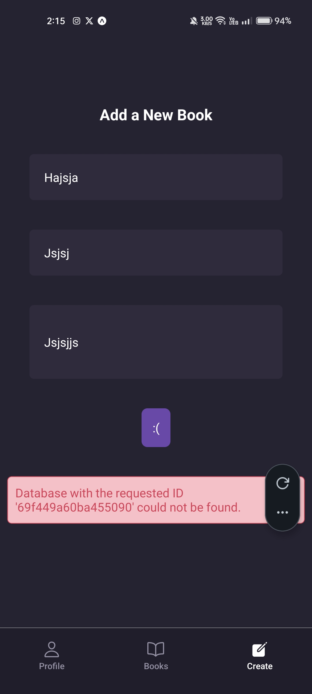

These notes cover the implementation of **Creating Documents** in Appwrite and building a **Submission Form** in React Native. This process links your UI state to the backend database while handling permissions.

---

## **1. Implementing `createBook` in Context**

To save a record, you use the `databases.createDocument` method. You must pass the IDs, the data object, and specific **Permissions**.

**File Path:** `./contexts/BooksContext.jsx`

- **`ID.unique()`**: Generates a unique string for the document ID.
- **Permissions**: We use `Permission` and `Role` to ensure only the creator can read, update, or delete the book.

```jsx
import { ID, Permission, Role } from "react-native-appwrite";
import { databases } from "../lib/appwrite";
import { useUser } from "../hooks/useUser";

// ... inside BooksProvider
const { user } = useUser();

async function createBook(data) {
  try {
    const newBook = await databases.createDocument(
      databaseId,
      collectionId,
      ID.unique(),
      {
        ...data,
        userId: user.$id, // Associate the book with the logged-in user
      },
      [
        Permission.read(Role.user(user.$id)), // Only this user can read
        Permission.update(Role.user(user.$id)), // Only this user can update
        Permission.delete(Role.user(user.$id)), // Only this user can delete
      ],
    );
    return newBook;
  } catch (error) {
    console.log("Create Book Error:", error.message);
    throw error;
  }
}
```

---

## **2. Creating the Submission Form UI**

The form uses local state for each input field and a `loading` state to prevent multiple submissions (double-tapping).

**File Path:** `./app/(dashboard)/create.jsx`

- **`multiline={true}`**: Used for the description to allow multiple lines of text.
- **`disabled={loading}`**: Prevents the user from clicking the button while the request is in flight.

```jsx
const [title, setTitle] = useState("");
const [author, setAuthor] = useState("");
const [description, setDescription] = useState("");
const [loading, setLoading] = useState(false);

const { createBook } = useBooks();
const router = useRouter();

const handleSubmit = async () => {
  // Basic validation
  if (!title.trim() || !author.trim() || !description.trim()) return;

  setLoading(true);
  try {
    await createBook({ title, author, description });

    // Reset Form
    setTitle("");
    setAuthor("");
    setDescription("");

    router.replace("/books"); // Redirect after success
  } catch (err) {
    console.log(err);
  } finally {
    setLoading(false);
  }
};
```

---

## **3. Layout & UX Details**

- **TouchableWithoutFeedback**: Wraps the screen. When the user taps outside a text input, `Keyboard.dismiss()` is called to hide the keyboard.
- **Dynamic Button Text**: Shows "Saving..." while the request is pending to provide visual feedback.

---

## **4. Database Attribute Mapping**

When you spread the `data` object into `createDocument`, the keys must **exactly match** the Attribute keys you created in the Appwrite Console.

| **Attribute Key** | **UI State**  | **Source**            |
| ----------------- | ------------- | --------------------- |
| `title`           | `title`       | Text Input            |
| `author`          | `author`      | Text Input            |
| `description`     | `description` | Multi-line Text Input |
| `userId`          | `user.$id`    | Global User Context   |

---

## **5. Logic Flow Recap**

| **Sequence**    | **Location**       | **Action**                                                                   |
| --------------- | ------------------ | ---------------------------------------------------------------------------- |
| **1. Input**    | `create.jsx`       | User types book details into state-bound inputs.                             |
| **2. Submit**   | `create.jsx`       | `handleSubmit` validates and calls `createBook()`.                           |
| **3. Request**  | `BooksContext.jsx` | `databases.createDocument` sends data + unique ID + Permissions to Appwrite. |
| **4. Response** | Appwrite           | Document is saved in the collection; server returns success.                 |
| **5. Cleanup**  | `create.jsx`       | Form is cleared and user is redirected to the library.                       |

### **Key Takeaway**

Setting **Document Level Permissions** in the `createDocument` call is the most secure way to handle private data. Even if someone finds the document ID, Appwrite's server will block anyone who is not the specific `userId` you defined in the permissions array.

---

---

---


.png>)

---

---

---

---

---

---

---


