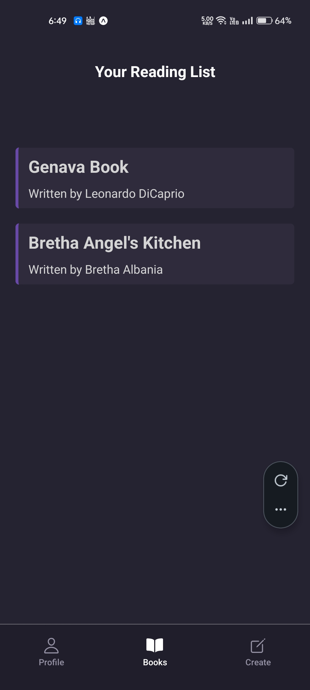

When we click to add New Book Data, it takes us to the Book Page, but we can’t see that data cuz it is not updated yet. data is still there, but isn’t reloaded.

---

These notes cover the implementation of **Real-time Data Subscriptions** in Appwrite. This allows your app to "listen" for changes in the database (like a new book being added) and update the UI instantly without needing a manual refresh or a new network request.

---

## **1. Appwrite Client Setup for Real-time**

To enable real-time features, you must ensure the client is pointing to the correct Appwrite cloud endpoint.

**File Path:** `./lib/appwrite.js`

```jsx
import { Client, Account, Databases, ID } from "react-native-appwrite";

const client = new Client();

client
  .setEndpoint("https://cloud.appwrite.io/v1") // Mandatory for Real-time
  .setProject("YOUR_PROJECT_ID")
  .setPlatform("com.yourname.shelfie");

export { client }; // Ensure you export the client instance
```

---

## **2. Subscribing to Collection Events**

We use the `client.subscribe` method inside the `BooksProvider` to listen for specific database events.

**File Path:** `./contexts/BooksContext.jsx`

### **The Channel Format**

A channel is a specific string that tells Appwrite exactly what to watch. To listen to all document changes in a collection, the format is:

`databases.[DATABASE_ID].collections.[COLLECTION_ID].documents`

### **Implementation Logic**

- **Payload**: The data of the newly created or changed document.
- **Events**: An array of strings describing the action (e.g., `databases.default.collections.books.documents.65f...create`).

```jsx
useEffect(() => {
  let unsubscribe;

  if (user) {
    fetchBooks();

    // Define the channel to listen to
    const channel = `databases.${databaseId}.collections.${collectionId}.documents`;

    // Subscribe to the channel
    unsubscribe = client.subscribe(channel, (response) => {
      const { payload, events } = response;

      // Only update state if a document was 'created'
      if (events[0].includes("create")) {
        setBooks((prevBooks) => {
          // Add the new book (payload) to the existing list
          return [...prevBooks, payload];
        });
      }
    });
  } else {
    setBooks([]);
  }

  // Cleanup: Stop listening when the component unmounts or user logs out
  return () => {
    if (unsubscribe) unsubscribe();
  };
}, [user]);
```

---

## **3. The "Cleanup" Function**

In React's `useEffect`, returning a function is known as the **Cleanup Phase**.

- **Why?** If you don't unsubscribe, your app will keep multiple listeners open every time the user logs in/out, leading to memory leaks and duplicate data.
- **When?** It runs right before the component unmounts or just before the `useEffect` re-runs due to a dependency change (`user`).

---

## **4. Real-time Logic Flow**

| **Sequence**     | **Actor**          | **Action**                                                        |
| ---------------- | ------------------ | ----------------------------------------------------------------- |
| **1. Change**    | Appwrite Server    | A new document is successfully written to the database.           |
| **2. Broadcast** | Appwrite Real-time | The server sends a WebSocket message to all active subscribers.   |
| **3. Receive**   | App Callback       | The callback function in your app receives the `response` object. |
| **4. Process**   | logic              | The app checks if the event is a `"create"` event.                |
| **5. Update**    | React State        | `setBooks` adds the `payload` (new book) to the array.            |
| **6. Sync**      | FlatList           | The UI automatically adds a new card to the list.                 |

---

## **5. Why use Real-time vs. Manual Fetch?**

1. **UX**: The user doesn't have to wait or navigate back and forth to see their new data.
2. **Multi-Device**: If a user adds a book on their tablet, it will instantly pop up on their phone if both apps are open.
3. **Efficiency**: You only send the _new_ book over the network, rather than re-fetching the entire list of 100 books.

### **Key Takeaway**

Real-time subscriptions turn your app from a "static" viewer into a "living" interface. By listening for the `create` event and spreading the `prevBooks`, you ensure the UI is always a perfect mirror of the database.

---

<br>

Johe create tab sy Form Data p fill keya, we got instant changes on the “Books” tab.


