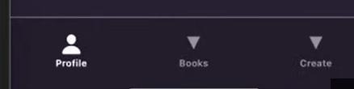
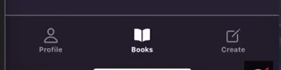

## 10- Custom Tab Icons & Vector Icons

### 1. Installing Icon Packages

React Native doesn't include icons by default. In the Expo ecosystem, we use `@expo/vector-icons`, which bundles several popular icon sets like Ionicons, FontAwesome, and Material Design.

- **Installation:** If not already present, run:

```bash
npm expo install @expo/vector-icons
```

- **Importing:** Choose a specific set (e.g., Ionicons):

```bash
import { Ionicons } from '@expo/vector-icons';
```

### 2. The `tabBarIcon` Property

To replace the default triangles, we use the `tabBarIcon` property inside the `options` prop of a `Tabs.Screen`.

- **The Function:** The value of `tabBarIcon` is a function that receives an object. We destructure `{ focused }` from this object to know if the tab is currently active.
- **Return Value:** The function must return a component (like `<Ionicons />`).

### 3. Dynamic Icons (The Outline Pattern)

A common UI pattern in mobile apps is to show an **outlined** icon when a tab is inactive and a **filled** icon when it is focused. We use a ternary operator to switch names:

```bash
tabBarIcon: ({ focused }) => (
  <Ionicons
    size={24}
    name={focused ? 'person': 'person-outline'}
    color={focused ? theme.iconColorFocused : theme.iconColor}
  />
)
```



### 4. Implementation Example

Here is how the individual screens are configured in the `(dashboard)/_layout.jsx`:

| **Screen**  | **Focused Icon** | **Unfocused Icon** |
| ----------- | ---------------- | ------------------ |
| **Books**   | `book`           | `book-outline`     |
| **Create**  | `create`         | `create-outline`   |
| **Profile** | `person`         | `person-outline`   |

**Code Snippet:**

```bash
<Tabs.Screen
  name="profile"
  options={{
    title: "Profile",
    tabBarIcon: ({ focused }) => (
      <Ionicons
        name={focused ? 'person' : 'person-outline'}
        size={24}
        color={focused ? theme.iconColorFocused : theme.iconColor}
      />
    )
  }}
/>
```



### Key Takeaways

- **Feedback:** Using the `focused` state for both the **icon name** and the **color** provides clear visual feedback to the user.
- **Consistency:** Always use the same icon set (e.g., all `Ionicons`) across your tabs to maintain a consistent visual style.
- **Sizing:** A `size` of `24` is standard for bottom tab navigation, ensuring they are touch-friendly but not overwhelming.
