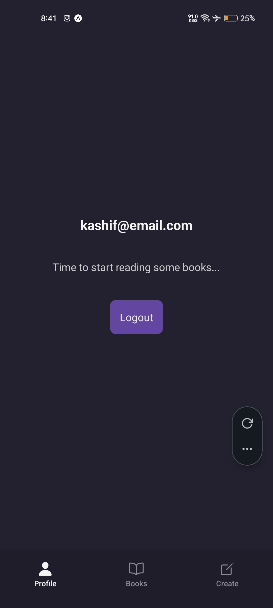
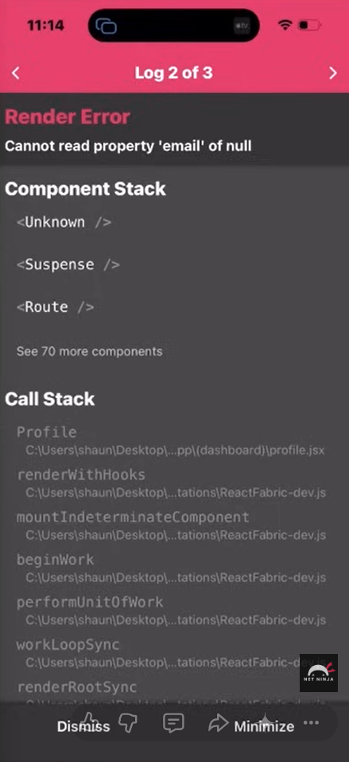

# Persistent Authentication

These notes explain how to achieve Persistent Authentication. When you reload a mobile app, the JavaScript state (RAM) is wiped. You must reach out to Appwrite during the app's startup phase to check if a valid session still exists on the server and restore the user state.

---

### 1. The Problem: State Reset on Reload

Even if a user is "logged in" on the Appwrite backend, reloading the app resets the user state in your React Context to null. This causes errors when components try to access `user.email`.

```javascript
import { createContext, useState, useEffect } from "react";
import { account } from "../lib/appwrite";

export const UserContext = createContext();

export function UserProvider({ children }) {
  const [user, setUser] = useState(null);
  const [authChecked, setAuthChecked] = useState(false); // Flag for startup check

  useEffect(() => {
    getInitialUserValue();
  }, []);

  async function getInitialUserValue() {
    try {
      const response = await account.get(); // Reach out to Appwrite
      setUser(response); // If session exists, update state
    } catch (error) {
      setUser(null); // No session found
    } finally {
      setAuthChecked(true); // Check is complete, regardless of outcome
    }
  }

  // ... login, register, logout functions ...

  return (
    <UserContext.Provider
      value={{ user, authChecked, login, logout, register }}
    >
      {children}
    </UserContext.Provider>
  );
}
```

---

### 2. Restoring User State

We use a `useEffect` hook inside the provider to run a "check" once the app starts.

**File Path:** `./contexts/UserContext.jsx`

- **`account.get()`**: The key Appwrite method that returns the current session if it exists.
- **`authChecked` Flag**: A secondary bit of state used to track if the initial check has finished. This prevents the app from assuming a user is "logged out" just because the network request hasn't finished yet.

---

### 3. Using the User Data in the UI

Once the state is restored, you can display user-specific details on the dashboard.

**File Path:** `./app/(dashboard)/profile.jsx`

```javascript
import { useUser } from "../../hooks/useUser";
import ThemedText from "../../components/ThemedText";
import ThemedView from "../../components/ThemedView";

const Profile = () => {
  const { user } = useUser();

  return (
    <ThemedView style={styles.container}>
      {/* Display the email from the Appwrite user object */}
      <ThemedText title={true}>
        {user ? user.email : "Not Logged In"}
      </ThemedText>
    </ThemedView>
  );
};
```

---

### 4. Preventing "Null" Errors

If you try to access `user.email` while `user` is null (e.g., right after logging out or before the startup check finishes), the app will crash.

**Safe Access Patterns:**

- **Optional Chaining:** `user?.email` (returns undefined instead of crashing).
- **Conditional Rendering:** `{user && <Text>{user.email}</Text>}`.
- **Auth Guards:** (Coming in the next lesson) Redirecting users away from the page entirely if they aren't logged in.

---

### 5. Logic Flow Recap

| Phase          | Action                             | Result                                  |
| :------------- | :--------------------------------- | :-------------------------------------- |
| **App Starts** | `UserProvider` mounts.             | `user` is null, `authChecked` is false. |
| **Check Runs** | `useEffect` calls `account.get()`. | A network request goes to Appwrite.     |
| **Response**   | Appwrite returns the user object.  | `setUser(response)` is called.          |
| **Finalize**   | `finally` block runs.              | `setAuthChecked(true)` is set.          |
| **Render**     | `Profile.jsx` re-renders.          | The user's email becomes visible.       |

**Key Takeaway**
The `authChecked` flag is vital for User Experience. It allows you to show a loading spinner or a blank screen until you are certain about the user's authentication status, preventing "flicker" where the app shows the login screen for a split second before realizing the user is actually logged in.

- Implement a Loading Screen using the `authChecked` flag
- Learn about Protected Routes in Expo Router

---

#### Now In Action



#### Great

but but if use is not logged in → and tryna access the Profile Page this wil happen


as user → Null, and try to access email value from the Null will cause the Error
SO →
