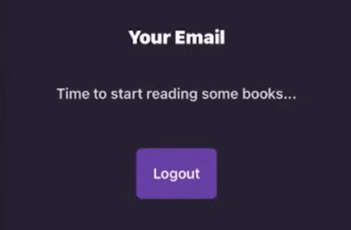
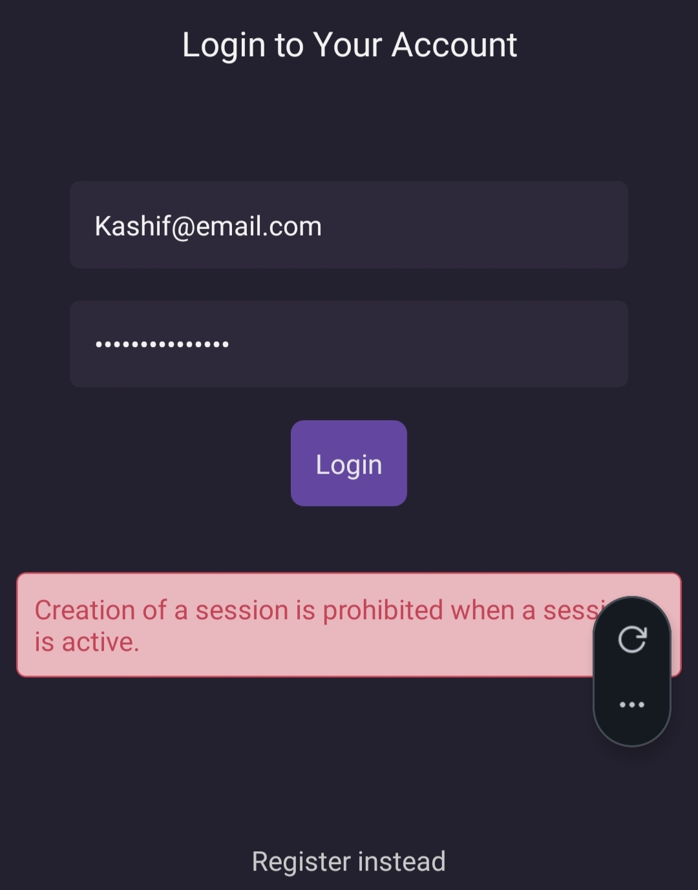
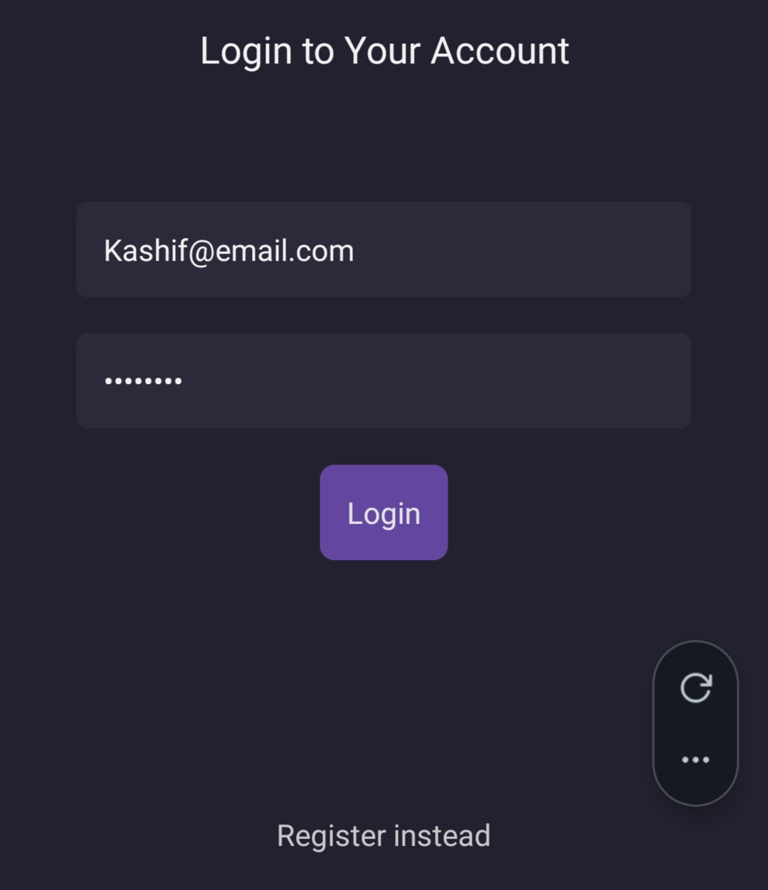

Here are the notes for implementing the **Logout** functionality. These cover the logic in the global context and how to trigger it from a specific dashboard page.

---

### 1. Implementing Logout Logic

In Appwrite, logging out means deleting the "session" stored on the server. We also need to clear our local state so the app knows there is no longer a logged-in user.

**File Path:** `./contexts/UserContext.jsx`

```javascript
// ... inside UserProvider
async function logout() {
  try {
    // 1. Delete the current active session from Appwrite
    await account.deleteSession("current");

    // 2. Clear the local global state
    setUser(null);
  } catch (error) {
    console.log("Logout Error:", error.message);
    throw error;
  }
}

// Ensure logout is included in the Provider value
return (
  <UserContext.Provider value={{ user, login, logout, register }}>
    {children}
  </UserContext.Provider>
);
```

---

### 2. Triggering Logout from the UI

We typically place the logout button on a settings or profile page. By using the `useUser` hook, we can access the logout function directly.

**File Path:** `./app/(dashboard)/profile.jsx`

- **Import Hook:** Bring in `useUser` to access global actions.
- **Component Usage:** Use the `ThemedButton` to trigger the logout action.

```javascript
import { StyleSheet, Text } from "react-native";
import { useUser } from "../../hooks/useUser";
import ThemedView from "../../components/ThemedView";
import ThemedText from "../../components/ThemedText";
import ThemedButton from "../../components/ThemedButton";

const Profile = () => {
  const { logout } = useUser(); // Grab logout from context

  return (
    <ThemedView style={styles.container}>
      <ThmedText title={true}>Your Profile</ThemedText>

      <ThemedButton onPress={logout}>
        <Text style={{ color: "#F2F2F2" }}>Log Out</Text>
      </ThemedButton>
    </ThemedView>
  );
};

export default Profile;

const styles = StyleSheet.create({
  container: {
    flex: 1,
    justifyContent: "center",
    alignItems: "center",
  },
});
```

---

### 3. The Session Lifecycle

It is important to understand that Appwrite considers a user "active" as long as a session exists.

- **Login/Register:** Creates a session.
- **Logout:** Deletes the session ("current").
- **Conflict:** If you try to log in while a session is already active, Appwrite throws an error: _"Creation of a session is prohibited when a session is active."_ This is why the logout function is a mechanical necessity for testing multiple accounts.

---

### 4. Verification Strategy

Since we don't have a "Protected Route" system yet (redirecting to login automatically), you can verify the logout worked by:

- **The State Check:** Log `user` in your layout. It should turn to `null` after clicking logout.
- **The "Register Test":** If you can register a new user without getting a "session active" error, the logout was successful.
- **Appwrite Console:** Check the "Sessions" tab for a user in the Appwrite dashboard; the active session should disappear.

---

### Key Takeaways

- **`deleteSession("current")`**: This specifically targets the session on the device the user is currently using.
- **State Synchronization:** Always update your `setUser(null)` state after the API call succeeds to keep the UI in sync with the backend.
- **Button Setup:** Pass the function reference (`onPress={logout}`) rather than invoking it immediately (`onPress={logout()}`).

---


When you press LOGOUT You will get log-out.

Now you can Try to login it won’t show you this error:


Now it got login again after log-out.


