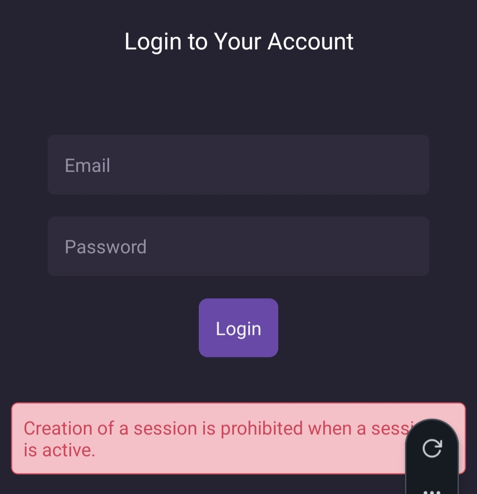

# Error Handling in React Native & Appwrite

These notes cover the implementation of robust error handling when working with a backend like Appwrite. The focus is on the **"Throw & Catch"** pattern—throwing errors from a global context and catching them in individual screens to update the UI dynamically.

---

## 1. The "Throw & Catch" Pattern

When using a service like Appwrite, errors often occur inside your **Context** (the logic layer). Instead of simply logging them to the console, you must **throw** them. This ensures the UI component calling the function is notified that an operation failed.

**File:** `./contexts/UserContext.jsx`

Replace `console.log(error)` with `throw error`. This propagates the error up to the component that triggered the request.

```jsx
async function register(email, password) {
  try {
    await account.create(ID.unique(), email, password);
    await login(email, password);
  } catch (error) {
    // Propagate the error so the UI can 'catch' and display it
    throw error;
  }
}
```

---

## 2. Managing Error State in Screens

Each authentication screen (Login or Register) needs its own local state to track and display errors to the user.

**File:** `./app/(auth)/login.jsx` (or `register.jsx`)

- **Initial State:** Start with `null`.
- **The Reset Pattern:** Always set the error back to `null` at the start of a new submission. This clears old error messages while the new request is processing.

```jsx
const [error, setError] = useState(null);

const handleSubmit = async () => {
  setError(null); // Step 1: Reset before trying again

  try {
    await login(email, password);
  } catch (err) {
    setError(err.message); // Step 2: Capture the Appwrite error message
  }
};
```

---

## 3. Conditional Rendering of Errors

Use the **short-circuit operator (`&&`)** to render the error message only when the state contains a value.

**File:** `./app/(auth)/login.jsx`

```jsx
{
  error && (
    <>
      <Spacer height={20} />
      <Text style={styles.errorText}>{error}</Text>
    </>
  );
}
```

> **Tip:** Appwrite error messages (e.g., "Invalid credentials") can be technical. In a production app, consider mapping these codes to user-friendly strings like _"Oops! That password doesn't look right."_

---

## 4. Styling for Visibility

Use high-contrast "Warning" colors (like Red or Orange) to ensure the error is immediately visible to the user.

**Common Error Styles:**

```jsx
const styles = StyleSheet.create({
  errorText: {
    color: "#cc475a", // Warning Red
    backgroundColor: "#ffebee",
    padding: 15,
    borderRadius: 8,
    borderWidth: 1,
    borderColor: "#cc475a",
    textAlign: "center",
    marginHorizontal: 20,
  },
});
```



---

## 5. Logic Flow Summary

| Step           | Location      | Action                                                         |
| :------------- | :------------ | :------------------------------------------------------------- |
| **1. Request** | `UserContext` | Calls the Appwrite API.                                        |
| **2. Failure** | `UserContext` | `catch` block executes and `throws` the error.                 |
| **3. Handle**  | `login.jsx`   | `handleSubmit` catches the error and calls `setError`.         |
| **4. Display** | `login.jsx`   | The UI detects `error` is truthy and renders the `<Text>` box. |

---

## 💡 Key Takeaway

Errors are a critical part of the **User Experience (UX)**, not just for developer debugging. By using local state and conditional rendering, you ensure the user is never left wondering why an action failed.
